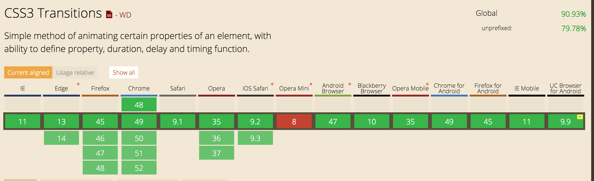
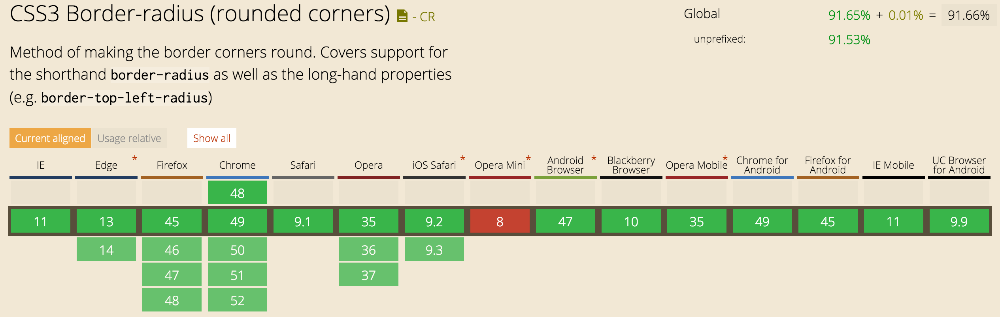
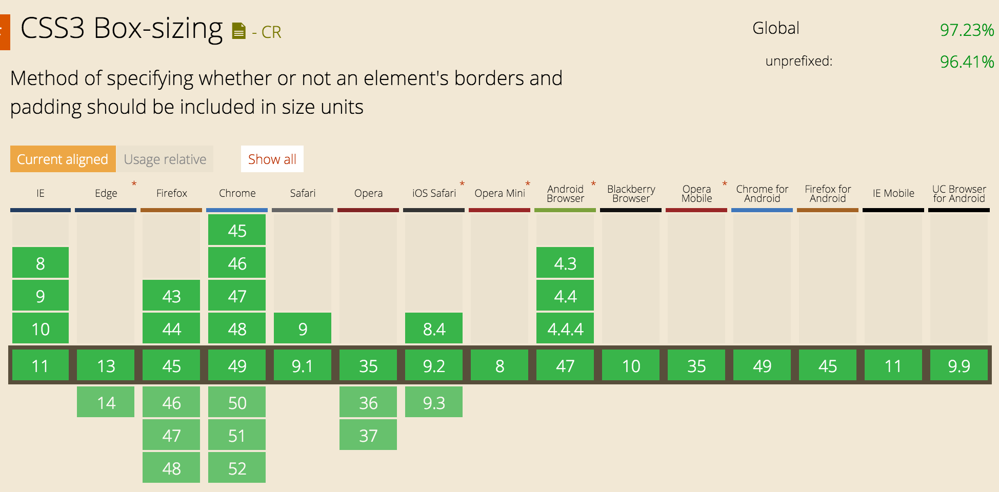
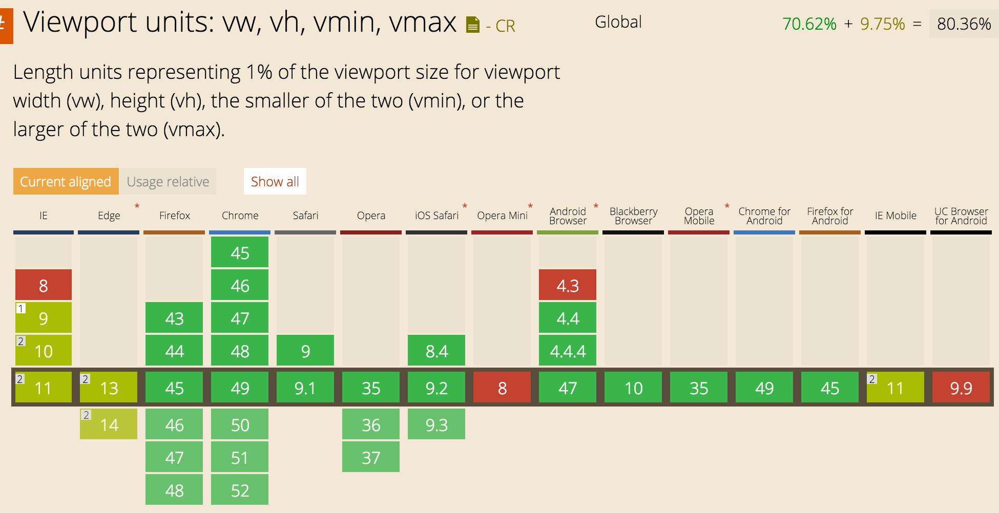
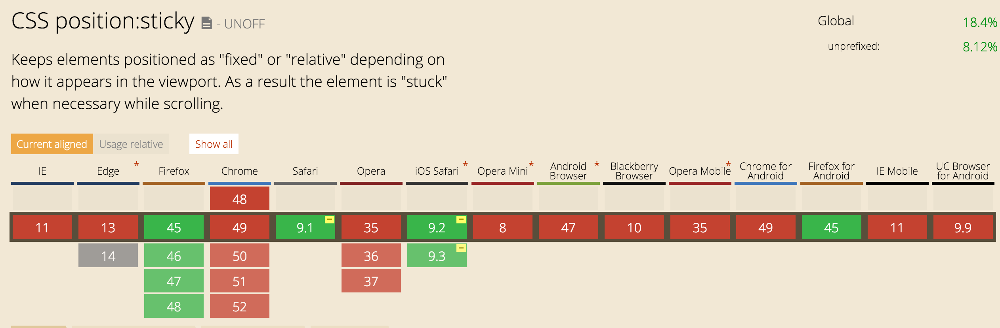

#usecase

#laag 1: html
Als de gebruiker enkel HTML aan heeft staan krijgt deze de lijst met contacten te zien, samen met de telefoonnummers. De applicatie is dan nogsteeds te gebruiken.

#laag 2: css
Als de gebruiker ook CSS aan heeft staan krijgt de gebruiker een gestylde lijst van contacten te zien, samen met de telefoonnummers. De applicatie is dan nogsteeds te gebruiken.

###Transitions
Transitions worden door de meeste moderne browsers ondersteund, maar niet door de verouderde als IE8,9,10. De transitions zijn echter als een enhancement toegevoegd, en verbreken dus niets van de bruikbaarheid van de applicatie als deze niet weergegeven worden.

###Border-radius

Voor border-radius geld hetzelfde als transition, de enige plek waar border radius toegepast is, is de contacten avatar. Mocht border-radius niet ondersteund worden, ziet de gebruiker een vierkante afbeelding, maar kan hij de applicatie nogsteeds goed gebruiken.

###Border-box
box sizing geeft enkel problemen met IE8. Zodra je met IE8 box-sizing gebruikt in combinatie met een min/max width of height, wordt de box-sizing genegeerd. Deze combinatie heb ik dus niet gebruikt in de CSS.

###Viewport en em
viewport wordt in veel browsers nog niet goed ondersteund. Elke gebruikte viewport unit heeft daarom een fallback op em, en mocht deze ook niet ondersteund worden een fallback op pixels.

#sticky
sticky wordt door nog maar weinig browsers ondersteund. om deze reden is sticky niet toegepast op de belangrijke onderdelen van de applicatie. Sticky wordt hier gebruikt als enhancement, en is geen vereiste om nog optimaal van de applicatie gebruik te maken.

#laag 3: javascript
Mocht de gebruiker ook gewoon zijn javascript aan hebben staan wordt de statische html vervangen door een json bestand, waarmee de data ingeladen wordt. Ook komt er dan een belknop naar voren, waardoor er automatisch gebeld kan worden met het contact.
